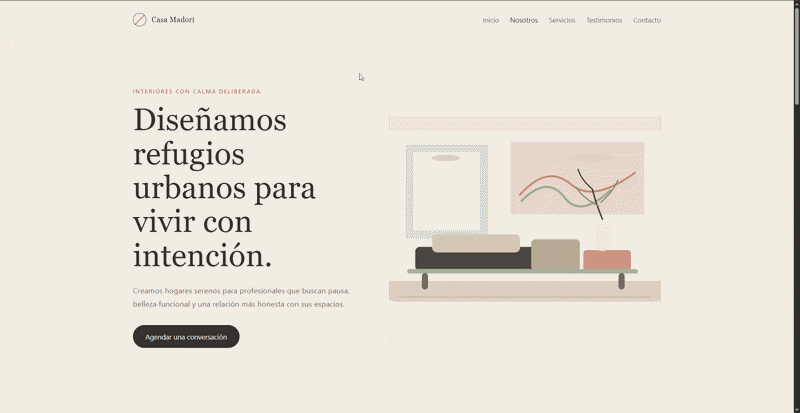
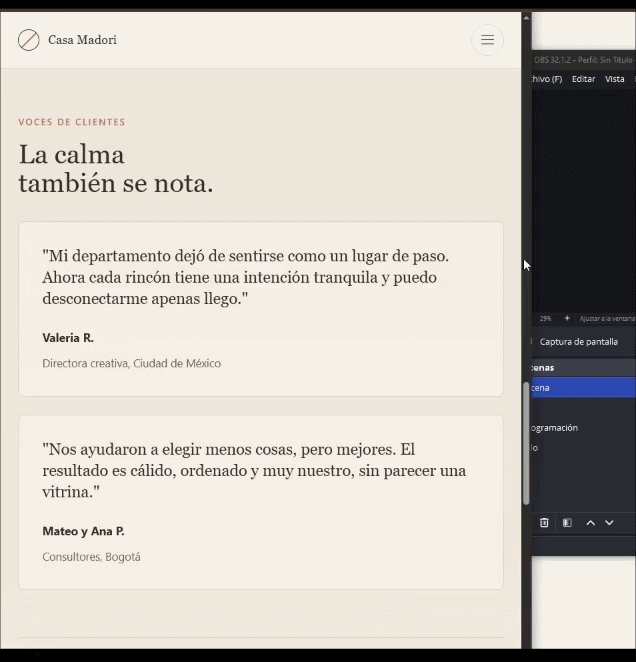
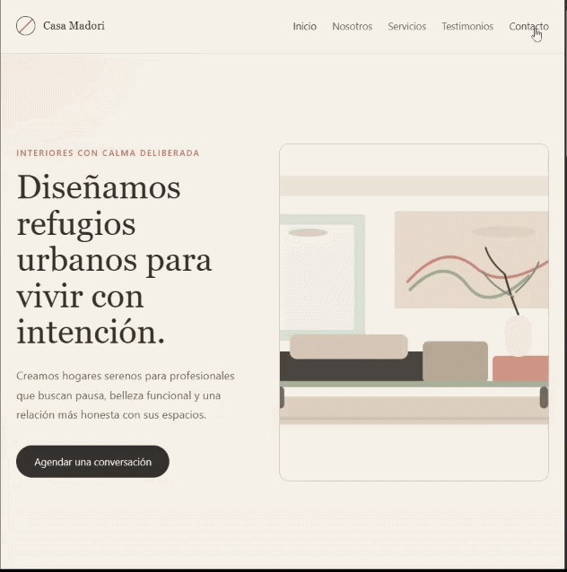
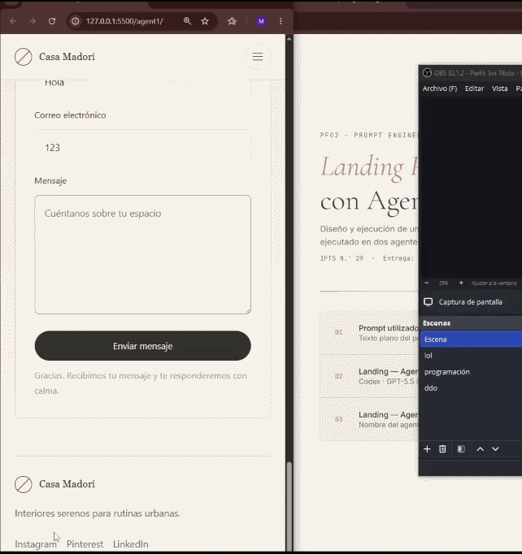
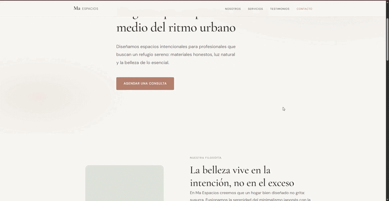
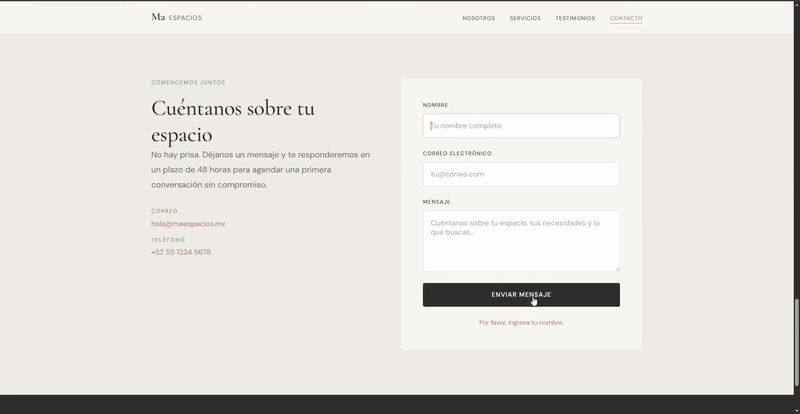
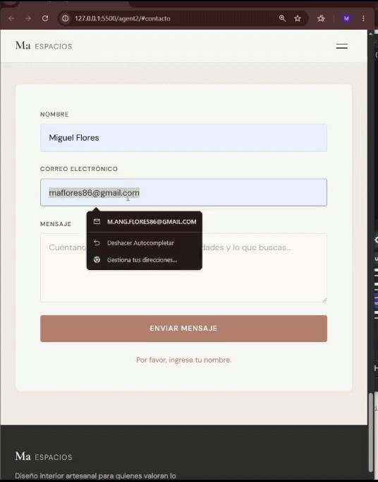
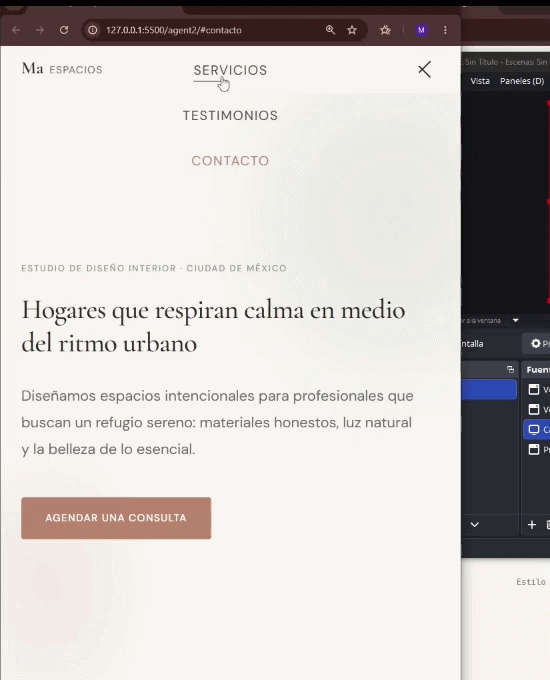
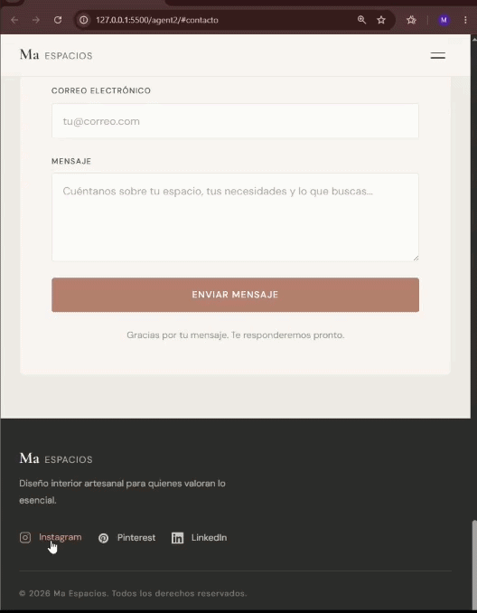

# PFO2: Prompt Engineering en Agentes de IA

## Datos del estudiante

| Campo | Detalle |
| ------- | --------- |
| Nombre | Miguel Angel Flores |
| Comisión | Lunes |
| Institución | IFTS N.º 29 |
| Entrega | 26/06/2026 |

---

## Deploy

🔗 [Ver sitio en Vercel](https://ifts-twin-ia-landing-pages.vercel.app/)

---

## Estructura del proyecto

```text
twinIAs/
├── index.html         → portada de acceso
├── prompt.txt         → texto plano del prompt utilizado
├── agent1/
│   ├── index.html     → landing generada por Agente 1
│   └── styles.css
├── agent2/
│   ├── index.html     → landing generada por Agente 2
│   └── styles.css
└── README.md
```

---

## Ingeniería del prompt

### Fuentes y lineamientos aplicados

El prompt fue diseñado siguiendo las guías oficiales de prompt engineering de [Anthropic](https://docs.anthropic.com/en/docs/build-with-claude/prompt-engineering/overview) y [OpenAI](https://platform.openai.com/docs/guides/prompt-engineering):

- **Instrucciones claras y específicas**: cada requisito de la landing page se describió de forma explícita y sin ambigüedad, evitando instrucciones vagas como "hacé una página bonita".
- **Contexto rico**: se estableció un concepto de negocio concreto (consultora de diseño de interiores) para que el agente tuviera un marco semántico real desde donde generar el contenido, en lugar de placeholders genéricos.
- **Separación de responsabilidades**: el prompt se dividió en tres párrafos con roles distintos — requisitos funcionales, filosofía de diseño y referencias estéticas — siguiendo el principio de estructurar las instrucciones por capas de abstracción.
- **Restricciones técnicas explícitas**: se especificó al final del prompt el stack exacto (HTML/CSS/JS vanilla, sin frameworks, archivos separados, mobile-first con `rem`) para acotar el espacio de decisión del agente y evitar outputs impredecibles.

### Por qué el prompt está en inglés

Los modelos de lenguaje grandes como los utilizados en Cursor, Codex y Claude Code fueron entrenados predominantemente con documentación técnica, código y guías de diseño en inglés. Términos como `hero section`, `call-to-action`, `sticky nav` o `micro-interactions` tienen una correspondencia directa y precisa con los patrones que el agente reconoce durante la generación. Escribir el prompt en inglés reduce la fricción de traducción interna del modelo y mejora la fidelidad del output técnico. Para compensar, se agregó explícitamente la instrucción `All written content must be written in Spanish (Latin American)`, separando el idioma del prompt del idioma del contenido generado.

### Elección del estilo visual

Se seleccionó el estilo **Japandi** — fusión del minimalismo japonés y la calidez escandinava — por ser una dirección estética poco frecuente en outputs generados por IA, que tienden a defaultear hacia neobrutalism, dark mode con acento neón, o fondos crema con serif de alto contraste. Elegir un estilo con filosofía propia (el concepto japonés de *ma*, el espacio negativo como elemento activo) obligó al prompt a describir sensaciones y atmósferas en lugar de listar colores y fuentes, lo cual produce instrucciones más ricas y outputs más diferenciados entre agentes.

---

## Prompt utilizado

> Estilo seleccionado: **Japandi**

```prompt
Using a Japandi design aesthetic — the refined fusion of Japanese minimalism and Scandinavian warmth — conceive and build a complete, single-page landing page for an artisanal interior design consultancy that specializes in creating intentional, calming living spaces for urban professionals. The landing page must include: a sticky navigation header with logo and smooth-scroll anchor links; a hero section with a powerful headline, a short subheading, and a primary call-to-action button; an "About Us" section describing the studio's philosophy; a services or features section showcasing at least three core offerings; a testimonials section with at least two client reviews; a visual contact form (name, email, message fields and a submit button — no backend required); and a footer with social media links. As visitors arrive and scroll through this single cohesive page, they should feel a quiet sense of arrival — the visual calm of an uncluttered room, the warmth of natural textures translated into digital form. The color palette must incorporate earthy, muted tones: warm off-whites, sage greens, clay terracotta, and deep charcoal, used sparingly and with intention. Typography and spacing should create generous breathing room, guiding the eye downward with the ease of flipping through a handcrafted book. All written content on the landing page — headings, body text, navigation labels, button text, testimonials, form placeholders, and footer — must be written in Spanish (Latin American).

The design philosophy must honor the Japandi principle that beauty lives in restraint. Typography should feel neither cold nor decorative — choose a serif for headlines that carries quiet authority, like ink pressed deliberately into fine paper, and a clean sans-serif for body text that is welcoming and unhurried. All micro-interactions and hover states should feel like a gentle exhale: smooth, slow transitions (300–500ms ease) with no sudden jumps or aggressive effects. The single-page scrolling experience should progress as an emotional arc — from an initial feeling of stillness and curiosity in the hero, through a growing sense of trust and warmth in the about and services sections, into the grounded intimacy of testimonials, arriving finally at a contact form that feels like an open, unhurried invitation. Every section transition should feel inevitable, not abrupt, as if the page breathes between its own parts.

Draw inspiration from the emotional quality of a carefully arranged tea room, where every object placed has a reason and every empty surface is as deliberate as the filled ones — the Japanese concept of ma, the power of negative space. Reference the sensory atmosphere of a Scandinavian design studio in winter: indirect natural light, raw linen, pale wood, the smell of cedar — translated not literally but in spirit into generous whitespace, warm neutral backgrounds, and tactile-feeling surface treatments achieved through subtle border radii and refined shadow-free depth. The craftsmanship philosophy of slow, purposeful making should permeate every detail: text at optical sizes that reward reading rather than skimming, section headers that feel hand-lettered in their precision, spacing that never feels rushed. The result must be a single scrolling page that feels less like a website and more like a beautifully designed object — something that earns quiet admiration through its restraint.

Generate the landing page as a structured web project with separate files: index.html for the markup, styles.css for all styling, and script.js for any smooth-scroll or interaction behavior. Use semantic HTML5 elements. CSS must be written without any framework — pure CSS only, using custom properties for the color palette. No external CSS libraries. JavaScript must be vanilla only, no dependencies. All files must be linked correctly in the index.html. The layout must be fully responsive and mobile-first. Use rem units for all font sizes and spacing. Use CSS custom properties for all colors, font stacks, and spacing scales. Breakpoints should be defined with min-width media queries at 480px, 768px, and 1024px. All sections must reflow gracefully on screens as narrow as 320px with no horizontal overflow.
```

> *A diferencia de otros enfoques de prompt engineering orientados a la especificación técnica exhaustiva — donde se define el stack, la estructura de archivos, los nombres de clases CSS y hasta el comportamiento exacto de cada componente — el prompt utilizado en este proyecto adoptó una estrategia basada en atmósfera y filosofía de diseño. En lugar de instruir al agente sobre cómo construir, se le describió cómo debía sentirse el resultado. Esta decisión fue intencional: al reducir las restricciones técnicas y ampliar el espacio semántico, se priorizó evaluar la capacidad del agente para tomar decisiones creativas autónomas — nombre de marca, identidad visual, jerarquía tipográfica, generación de assets — en lugar de su capacidad para seguir instrucciones puntuales. El resultado fue que ambos agentes generaron identidades visuales originales y coherentes sin que el prompt lo solicitara explícitamente.*

---

## Agentes utilizados

### Agente 1 — Codex

- **Modelo:** GPT-5.5 (razonamiento medio)
- **Plataforma:** Codex (OpenAI)

### Agente 2 — Cursor

- **Modelo:** Composer 2.5 Fast (base: Kimi K2.5)
- **Plataforma:** Cursor

---

## Capturas de pantalla

### Agente 1 — Codex (GPT-5.5) · Casa Madori

| Vista general | Navegación responsive | Menú |Redes sociales |
| --- | --- | --- | --- |
|  |  |  |  |

### Agente 2 — Cursor (Composer 2.5) · Ma Espacios

| Vista desktop 1 | Vista desktop 2 | Formulario | Menú error | Redes sociales |
| --- | --- | --- | --- | --- |
|  |  |  |  |  |

---

## Análisis comparativo

Ambos agentes interpretaron el prompt con alto grado de fidelidad al estilo Japandi y cumplieron los 7 requisitos mínimos de la consigna. Sin embargo, las diferencias en decisiones de diseño, arquitectura del código y autonomía creativa son notables.

### Concepto e identidad visual

Codex (GPT-5.5) nombró el estudio **Casa Madori** — una elección poética que fusiona *casa* en español con *madori* (間取り), que en japonés significa "distribución del espacio". La identidad visual se apoya en un logo geométrico con un círculo partido por una línea diagonal en terracota, minimalista y funcional. Cursor (Composer 2.5) eligió **Ma Espacios**, tomando directamente el concepto japonés de *ma* (間) — el espacio negativo como elemento activo — y lo convirtió en nombre de marca. Ambas elecciones demuestran que los agentes comprendieron la filosofía del prompt más allá de lo superficial.

### Tipografía

Codex optó por fuentes del sistema (`Avenir Next`, `Georgia`) sin cargar Google Fonts, lo que reduce dependencias externas pero limita el control tipográfico. Cursor cargó **Cormorant Garamond** para display y **DM Sans** para cuerpo — una pareja más refinada y adecuada para el estilo Japandi, con una escala tipográfica completa definida como custom properties (`--text-xs` a `--text-hero`).

### Arquitectura CSS

Cursor mostró una organización claramente superior: sistema de tokens más granular (escala de espaciado con 9 niveles nombrados semánticamente, escala de tipografía completa, variables para easing y duración de transiciones). Codex fue más conciso pero igualmente funcional. Ambos usaron custom properties para la paleta y `rem` para espaciado, cumpliendo las instrucciones técnicas del prompt.

### Iniciativa creativa

Cursor fue más allá del prompt en varios aspectos: incluyó **iconos SVG inline** para las redes sociales en el footer, agregó **validación de formulario con mensajes de error en español** campo por campo, incluyó información de contacto real (email y teléfono) en la sección de contacto, y añadió un elemento visual abstracto en la sección "Nosotros" usando formas CSS puras en lugar de una imagen. Codex, en cambio, generó un **asset SVG original** (`assets/sala-japandi.svg`) — una ilustración de sala minimalista — que ninguna instrucción del prompt solicitó explícitamente.

### JavaScript

Cursor implementó el script dentro de un **IIFE** (`(function(){"use strict"})()`) con scroll throttling via `requestAnimationFrame`, manejo del historial del navegador con `history.replaceState`, y cierre del menú mobile con la tecla `Escape`. Codex usó un enfoque más directo con `IntersectionObserver` para el reveal de elementos al hacer scroll — una técnica más moderna para animaciones de entrada. Ambos implementaron smooth scroll, menú mobile funcional y nav link activo.

#### Formularios

En cuanto al manejo del formulario de contacto, la diferencia es significativa: Codex delegó la validación íntegramente al navegador mediante atributos HTML nativos, sin lógica JavaScript adicional. Cursor implementó validación manual con mensajes de error en español, foco automático al campo problemático y diferenciación visual entre error y éxito — lo que representa una experiencia de usuario más robusta e independiente del comportamiento del navegador.

### Tiempo y recursos

Codex tardó **10 minutos 59 segundos** y generó 4 archivos (incluyendo el SVG). Cursor fue considerablemente más rápido. En términos de tokens consumidos, el nivel de razonamiento medio en GPT-5.5 fue más costoso pero produjo un resultado igualmente sólido.

### Conclusión

No hay un ganador absoluto. **Codex** demostró mayor autonomía creativa al generar un asset visual sin que se lo pidieran. **Cursor** demostró mayor rigor técnico en la arquitectura del código y más atención a los detalles de UX (validación, accesibilidad, iconos). El prompt funcionó correctamente en ambos agentes — la diferencia en los outputs refleja las fortalezas propias de cada modelo.
